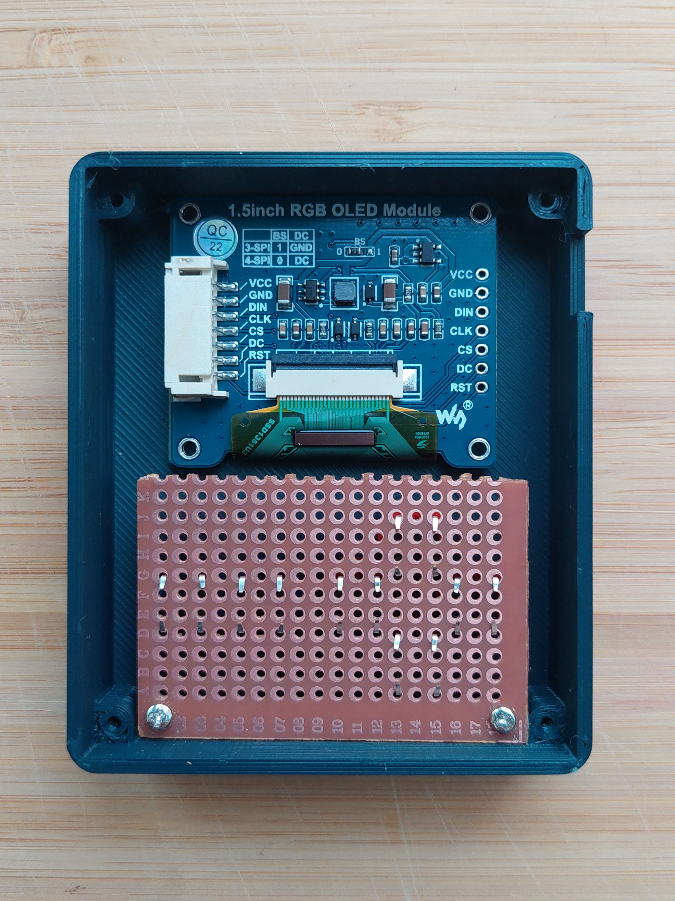

# armordeck

ArmorDeck is a tiny game console powered by esp32 microcontroller which plays a DOOM port. It was built purely as a learning experiment.
It features 4MB RAM, 32MB flash, 128x128 oled screen with 65536 colors, 6 buttons and rechargeable battery. Bluetooth audio is doable but not yet implemented.

### Assembly

Parts used:
- 1x ESP32: [[1]](https://www.dfrobot.com/product-2195.html)
- 1x Display: [[1]](https://www.waveshare.com/1.5inch-rgb-oled-module.htm)
- 1x Battery: [[1]](https://rpishop.cz/li-pol/3450-li-pol-baterie-37v-2000mah.html), [[2]](https://www.aliexpress.com/item/33001806434.html)
- 1x Prototype PCB: [[1]](https://www.aliexpress.com/item/1005002835181164.html)
- 6x Microswitch: [[1]](https://www.aliexpress.com/item/1005004001434474.html)

3D printed parts:
- 1x [Case top](hw/top.stl)
- 1x [Case bottom](hw/bottom.stl)
- 6x [Button cap](hw/button.stl)

Step 1:
- Prepare all the parts. Begin with the case top.


Step 2:
- Insert microswitches into prototype PCB. Place button caps onto microswitches.


Step 3:
- Insert display and buttons module into the case. Mount buttons module with 2xM2 screws.


Step 4:
- Insert esp32 microcontroller into the case.


Step 5:
- Solder display and button wires. Preferably with higher quality than pictured.


```c
// Display pins
#define PIN_MOSE 23
#define PIN_CLK 18
#define PIN_DC 26
#define PIN_RST 25
#define PIN_CS 0
// Button pins
#define PIN_LEFT 16
#define PIN_UP 35
#define PIN_RIGHT 12
#define PIN_DOWN 15
#define PIN_A 4
#define PIN_B 17
```


Step 6:
- Insert battery and connect it to the esp32.


Step 7:
- Place the case bottom and mount it with 4xM2 screws. Done!


### Compile

- Connect armordeck to a computer via a usb-c cable.
- Build and flash a project located at `armordeck/esp32` via [esp-idf](https://docs.espressif.com/projects/esp-idf/en/stable/esp32/get-started/vscode-setup.html).
- *or*
- Flash `armordeck/esp32/bin/armordeck.bin` file directly via [flash download tools](https://www.espressif.com/en/support/download/other-tools).


System controls:
- Press `button a` + `button b` to enter deep sleep.
- Press `button up` + `button down` + `button left` + `button right` to reboot.

Simulator:
- Run `Kinc/make` at `armordeck/simulator`.
- Build and run generated project at `armordeck/simulator/build/`.


Doom port is based on:
- https://github.com/NordicPlayground/nrf-doom
- https://github.com/kilograham/rp2040-doom
- https://github.com/fabiangreffrath/crispy-doom
- https://github.com/chocolate-doom/chocolate-doom
- https://github.com/ozkl/doomgeneric
- https://github.com/floooh/doom-sokol
- https://github.com/Kinc-Samples/Doom-Kinc
